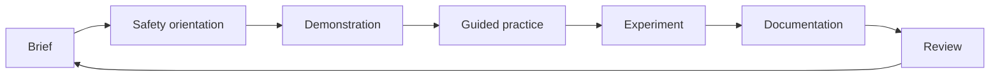

# Digital Fabrication Curriculum and Workshop Documentation Toolkit

Created in 2024, this repository is a curriculum support toolkit for robotic fabrication training. It collects how-to documentation, experiment outlines, diagrams, safety checklists, and workshop summary templates that can be adapted for classrooms, makerspaces, fabrication labs, and professional training sessions.

## Purpose

The toolkit helps facilitators plan and document hands-on digital fabrication workshops with a clear instructional structure. It is designed for programs that introduce learners to robotic fabrication workflows, safe shop practice, toolpath thinking, material testing, and reflective documentation.

## What is included

- Curriculum modules for a six-part robotic fabrication learning sequence
- Experiment outlines for calibration, material testing, end-effector behavior, and sensor-assisted workflows
- Safety checklists for general workshop practice, robotic cell operation, PPE, and emergency response
- Workshop templates for briefs, experiment logs, risk assessments, attendance, and final summaries
- Mermaid diagrams for workflow planning, shop layout, and documentation processes
- Assessment rubrics for safety, process documentation, fabrication quality, and reflection

## Recommended use

1. Start with [Curriculum Overview](docs/curriculum-overview.md) to select the right delivery format.
2. Review the [Facilitator Guide](docs/facilitator-guide.md) and safety files before scheduling a session.
3. Pick modules from [docs/modules](docs/modules) and experiments from [docs/experiments](docs/experiments).
4. Copy templates from [docs/templates](docs/templates) into each workshop folder or learning management system.
5. Use the diagrams in [docs/diagrams](docs/diagrams) to align participants, instructors, and technicians.

## Repository structure

```text
.
|-- docs/
|   |-- curriculum-overview.md
|   |-- facilitator-guide.md
|   |-- assessment-rubrics.md
|   |-- diagrams/
|   |-- experiments/
|   |-- modules/
|   |-- safety/
|   `-- templates/
|-- CONTRIBUTING.md
|-- CHANGELOG.md
|-- LICENSE
`-- README.md
```

## Workshop model

The toolkit follows a simple loop:



## Safety note

This toolkit is a curriculum and documentation aid. It does not replace machine manuals, institutional safety policy, local regulations, instructor supervision, or qualified risk assessment. Always adapt checklists to the specific robot, tooling, material, shop layout, and participant group.

## License

Released under the MIT License. See [LICENSE](LICENSE).

