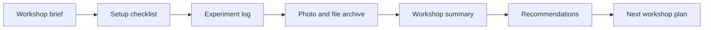

# Documentation Pipeline Diagram

```mermaid
flowchart LR
    A[Workshop brief] --> B[Setup checklist]
    B --> C[Experiment log]
    C --> D[Photo and file archive]
    D --> E[Workshop summary]
    E --> F[Recommendations]
    F --> G[Next workshop plan]
```

## Use

Use this diagram to remind facilitators that documentation should start before the workshop and continue through review.

