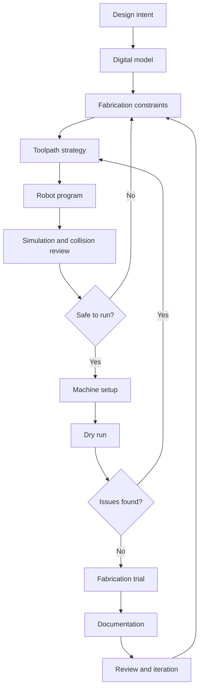

# Robotic Fabrication Workflow Diagram

```mermaid
flowchart TD
    A[Design intent] --> B[Digital model]
    B --> C[Fabrication constraints]
    C --> D[Toolpath strategy]
    D --> E[Robot program]
    E --> F[Simulation and collision review]
    F --> G{Safe to run?}
    G -- No --> C
    G -- Yes --> H[Machine setup]
    H --> I[Dry run]
    I --> J{Issues found?}
    J -- Yes --> D
    J -- No --> K[Fabrication trial]
    K --> L[Documentation]
    L --> M[Review and iteration]
    M --> C
```

## Use

Use this diagram during the introduction module to show that robotic fabrication is an iterative loop, not a one-way export process.

