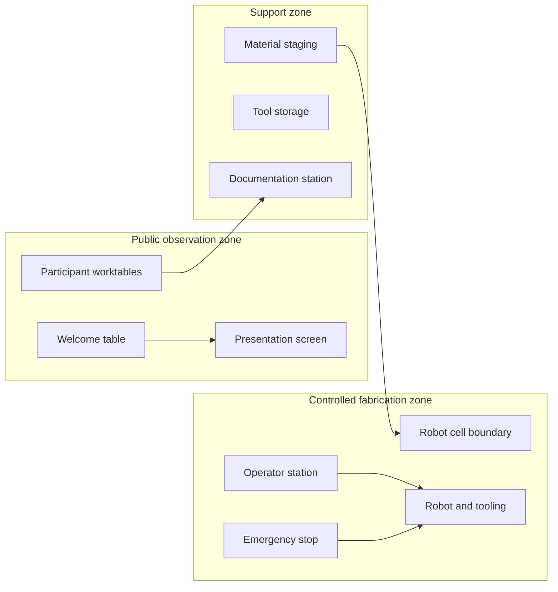

# Workshop Zone Layout Diagram

```mermaid
flowchart LR
    subgraph Public[Public observation zone]
        A[Welcome table]
        B[Presentation screen]
        C[Participant worktables]
    end

    subgraph Support[Support zone]
        D[Material staging]
        E[Tool storage]
        F[Documentation station]
    end

    subgraph Controlled[Controlled fabrication zone]
        G[Robot cell boundary]
        H[Robot and tooling]
        I[Emergency stop]
        J[Operator station]
    end

    A --> B
    C --> F
    D --> G
    J --> H
    I --> H
```

## Use

Adapt this layout for workshop planning. Every location should have a clear purpose, supervision requirement, and movement rule.

